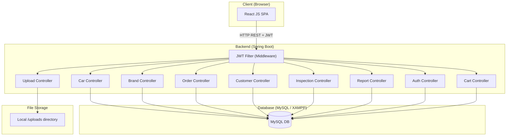
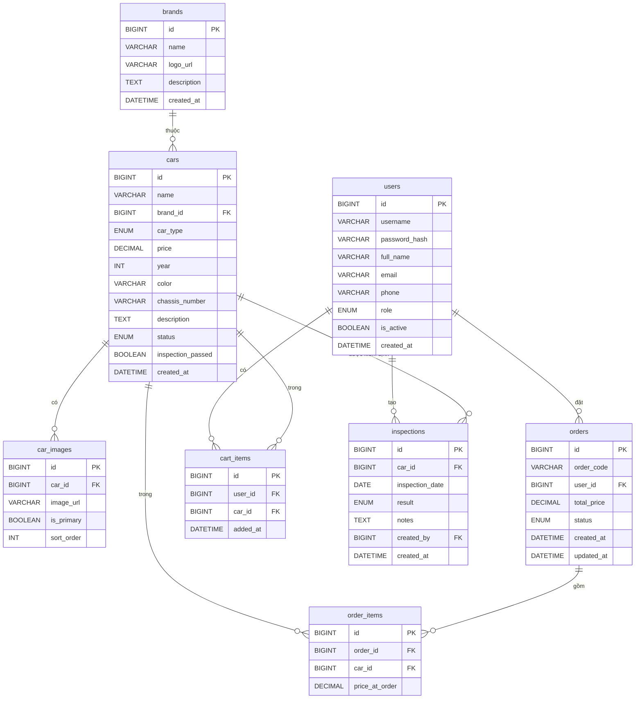
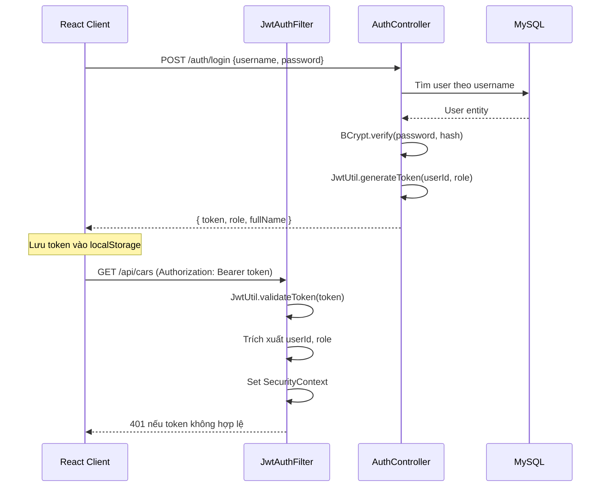
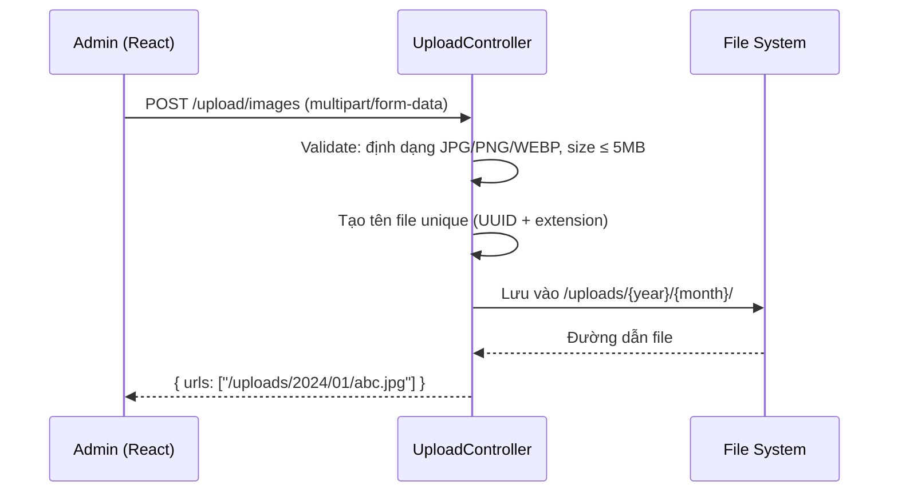

# Tài Liệu Thiết Kế Kỹ Thuật — Car Management Website (Tân Lộc)

## Tổng Quan

Hệ thống web quản lý xe **Tân Lộc** là một ứng dụng full-stack gồm hai giao diện chính:

- **Admin Portal**: Quản lý xe, hãng xe, khách hàng, đơn hàng, kiểm định xe, báo cáo thống kê.
- **User Portal**: Xem xe, tìm kiếm, lọc, thêm vào giỏ hàng, đặt mua.

Stack kỹ thuật:
- **Backend**: Java Spring Boot (REST API)
- **Frontend**: React JS (SPA)
- **Database**: MySQL trên XAMPP
- **Xác thực**: JWT (JSON Web Token)
- **Lưu trữ ảnh**: Local file system trên server

---

## Kiến Trúc Hệ Thống



**Luồng xử lý chính:**
1. React gửi HTTP request kèm `Authorization: Bearer <token>` header.
2. `JwtAuthenticationFilter` xác thực token, trích xuất `userId` và `role`.
3. Spring Security kiểm tra quyền truy cập endpoint.
4. Controller xử lý logic, gọi Service, Repository.
5. Trả về JSON response.

---

## Kiến Trúc Phân Lớp (Layered Architecture)

```
Controller Layer  →  Service Layer  →  Repository Layer  →  MySQL
                          ↓
                    DTO / Entity Mapping
```

- **Controller**: Nhận request, validate input, gọi Service.
- **Service**: Business logic, transaction management.
- **Repository**: JPA/Hibernate, truy vấn database.
- **DTO**: Data Transfer Object — tách biệt entity với response/request.
- **Entity**: JPA entity ánh xạ với bảng MySQL.

---

## Cấu Trúc Thư Mục Dự Án

### Backend (Spring Boot)

```
backend/
├── src/main/java/com/tanloc/carmanagement/
│   ├── config/
│   │   ├── SecurityConfig.java          # Spring Security + JWT config
│   │   ├── CorsConfig.java              # CORS cho React frontend
│   │   └── WebMvcConfig.java            # Static resource mapping cho /uploads
│   ├── controller/
│   │   ├── AuthController.java
│   │   ├── BrandController.java
│   │   ├── CarController.java
│   │   ├── OrderController.java
│   │   ├── CustomerController.java
│   │   ├── InspectionController.java
│   │   ├── ReportController.java
│   │   ├── UploadController.java
│   │   └── CartController.java
│   ├── service/
│   │   ├── AuthService.java
│   │   ├── BrandService.java
│   │   ├── CarService.java
│   │   ├── OrderService.java
│   │   ├── CustomerService.java
│   │   ├── InspectionService.java
│   │   ├── ReportService.java
│   │   ├── UploadService.java
│   │   └── CartService.java
│   ├── repository/
│   │   ├── UserRepository.java
│   │   ├── BrandRepository.java
│   │   ├── CarRepository.java
│   │   ├── OrderRepository.java
│   │   ├── CartRepository.java
│   │   └── InspectionRepository.java
│   ├── entity/
│   │   ├── User.java
│   │   ├── Brand.java
│   │   ├── Car.java
│   │   ├── Order.java
│   │   ├── OrderItem.java
│   │   ├── CartItem.java
│   │   ├── Inspection.java
│   │   └── CarImage.java
│   ├── dto/
│   │   ├── request/
│   │   │   ├── LoginRequest.java
│   │   │   ├── RegisterRequest.java
│   │   │   ├── CarRequest.java
│   │   │   └── OrderStatusRequest.java
│   │   └── response/
│   │       ├── AuthResponse.java
│   │       ├── CarResponse.java
│   │       ├── BrandResponse.java
│   │       └── DashboardResponse.java
│   ├── security/
│   │   ├── JwtUtil.java                 # Tạo và xác thực JWT
│   │   ├── JwtAuthenticationFilter.java # Filter kiểm tra token mỗi request
│   │   └── UserDetailsServiceImpl.java
│   └── exception/
│       ├── GlobalExceptionHandler.java  # @ControllerAdvice
│       ├── ResourceNotFoundException.java
│       └── BusinessException.java
├── src/main/resources/
│   ├── application.properties
│   └── uploads/                         # Thư mục lưu ảnh upload
└── pom.xml
```

### Frontend (React JS)

```
frontend/
├── public/
├── src/
│   ├── api/
│   │   ├── axiosInstance.js             # Axios với interceptor JWT
│   │   ├── authApi.js
│   │   ├── carApi.js
│   │   ├── brandApi.js
│   │   ├── orderApi.js
│   │   └── uploadApi.js
│   ├── components/
│   │   ├── layout/
│   │   │   ├── AdminLayout.jsx          # Layout với sidebar xanh đậm
│   │   │   ├── UserLayout.jsx
│   │   │   ├── Sidebar.jsx
│   │   │   ├── Header.jsx               # Search bar + user info
│   │   │   └── Footer.jsx               # © 2014 Tân Lộc
│   │   ├── common/
│   │   │   ├── BrandCard.jsx            # Card hãng xe
│   │   │   ├── CarCard.jsx              # Card xe
│   │   │   ├── ConfirmDialog.jsx
│   │   │   ├── ImageUpload.jsx
│   │   │   └── SearchBar.jsx
│   │   └── forms/
│   │       ├── BrandForm.jsx
│   │       ├── CarForm.jsx
│   │       └── InspectionForm.jsx
│   ├── pages/
│   │   ├── auth/
│   │   │   ├── LoginPage.jsx
│   │   │   └── RegisterPage.jsx
│   │   ├── admin/
│   │   │   ├── DashboardPage.jsx
│   │   │   ├── BrandManagementPage.jsx
│   │   │   ├── NewCarPage.jsx
│   │   │   ├── UsedCarPage.jsx
│   │   │   ├── CustomerPage.jsx
│   │   │   ├── OrderPage.jsx
│   │   │   ├── InspectionPage.jsx
│   │   │   └── ReportPage.jsx
│   │   └── user/
│   │       ├── CarListPage.jsx
│   │       ├── CarDetailPage.jsx
│   │       └── CartPage.jsx
│   ├── store/
│   │   ├── authSlice.js                 # Redux Toolkit: auth state
│   │   └── cartSlice.js
│   ├── hooks/
│   │   ├── useAuth.js
│   │   └── useDebounce.js               # Debounce cho search
│   ├── utils/
│   │   ├── formatCurrency.js
│   │   └── validators.js
│   ├── routes/
│   │   ├── PrivateRoute.jsx             # Bảo vệ route theo role
│   │   └── AppRouter.jsx
│   └── App.jsx
└── package.json
```

---

## Thiết Kế Database (MySQL Schema)

### Sơ Đồ ERD



### DDL Script

```sql
CREATE DATABASE IF NOT EXISTS tanloc_car_db CHARACTER SET utf8mb4 COLLATE utf8mb4_unicode_ci;
USE tanloc_car_db;

CREATE TABLE users (
    id BIGINT AUTO_INCREMENT PRIMARY KEY,
    username VARCHAR(50) NOT NULL UNIQUE,
    password_hash VARCHAR(255) NOT NULL,
    full_name VARCHAR(100) NOT NULL,
    email VARCHAR(100) NOT NULL UNIQUE,
    phone VARCHAR(15),
    role ENUM('ADMIN', 'USER') NOT NULL DEFAULT 'USER',
    is_active BOOLEAN NOT NULL DEFAULT TRUE,
    created_at DATETIME NOT NULL DEFAULT CURRENT_TIMESTAMP
);

CREATE TABLE brands (
    id BIGINT AUTO_INCREMENT PRIMARY KEY,
    name VARCHAR(100) NOT NULL UNIQUE,
    logo_url VARCHAR(500),
    description TEXT,
    created_at DATETIME NOT NULL DEFAULT CURRENT_TIMESTAMP
);

CREATE TABLE cars (
    id BIGINT AUTO_INCREMENT PRIMARY KEY,
    name VARCHAR(200) NOT NULL,
    brand_id BIGINT NOT NULL,
    car_type ENUM('NEW', 'USED') NOT NULL,
    price DECIMAL(15, 0) NOT NULL,
    year INT NOT NULL,
    color VARCHAR(50),
    chassis_number VARCHAR(100) NOT NULL UNIQUE,
    description TEXT,
    status ENUM('AVAILABLE', 'SOLD', 'RESERVED') NOT NULL DEFAULT 'AVAILABLE',
    inspection_passed BOOLEAN DEFAULT FALSE,
    created_at DATETIME NOT NULL DEFAULT CURRENT_TIMESTAMP,
    FOREIGN KEY (brand_id) REFERENCES brands(id)
);

CREATE TABLE car_images (
    id BIGINT AUTO_INCREMENT PRIMARY KEY,
    car_id BIGINT NOT NULL,
    image_url VARCHAR(500) NOT NULL,
    is_primary BOOLEAN NOT NULL DEFAULT FALSE,
    sort_order INT NOT NULL DEFAULT 0,
    FOREIGN KEY (car_id) REFERENCES cars(id) ON DELETE CASCADE
);

CREATE TABLE orders (
    id BIGINT AUTO_INCREMENT PRIMARY KEY,
    order_code VARCHAR(20) NOT NULL UNIQUE,
    user_id BIGINT NOT NULL,
    total_price DECIMAL(15, 0) NOT NULL,
    status ENUM('PENDING', 'CONFIRMED', 'PROCESSING', 'COMPLETED', 'CANCELLED') NOT NULL DEFAULT 'PENDING',
    created_at DATETIME NOT NULL DEFAULT CURRENT_TIMESTAMP,
    updated_at DATETIME NOT NULL DEFAULT CURRENT_TIMESTAMP ON UPDATE CURRENT_TIMESTAMP,
    FOREIGN KEY (user_id) REFERENCES users(id)
);

CREATE TABLE order_items (
    id BIGINT AUTO_INCREMENT PRIMARY KEY,
    order_id BIGINT NOT NULL,
    car_id BIGINT NOT NULL,
    price_at_order DECIMAL(15, 0) NOT NULL,
    FOREIGN KEY (order_id) REFERENCES orders(id),
    FOREIGN KEY (car_id) REFERENCES cars(id)
);

CREATE TABLE cart_items (
    id BIGINT AUTO_INCREMENT PRIMARY KEY,
    user_id BIGINT NOT NULL,
    car_id BIGINT NOT NULL,
    added_at DATETIME NOT NULL DEFAULT CURRENT_TIMESTAMP,
    UNIQUE KEY uq_cart_user_car (user_id, car_id),
    FOREIGN KEY (user_id) REFERENCES users(id),
    FOREIGN KEY (car_id) REFERENCES cars(id)
);

CREATE TABLE inspections (
    id BIGINT AUTO_INCREMENT PRIMARY KEY,
    car_id BIGINT NOT NULL,
    inspection_date DATE NOT NULL,
    result ENUM('PASSED', 'FAILED') NOT NULL,
    notes TEXT,
    created_by BIGINT NOT NULL,
    created_at DATETIME NOT NULL DEFAULT CURRENT_TIMESTAMP,
    FOREIGN KEY (car_id) REFERENCES cars(id),
    FOREIGN KEY (created_by) REFERENCES users(id)
);
```

---

## Thiết Kế API (REST Endpoints)

### Quy Ước Chung

- Base URL: `http://localhost:8080/api`
- Content-Type: `application/json`
- Xác thực: `Authorization: Bearer <JWT_TOKEN>`
- Response thành công: `{ "success": true, "data": {...} }`
- Response lỗi: `{ "success": false, "message": "...", "code": "ERROR_CODE" }`

### Auth API

| Method | Endpoint | Mô tả | Auth |
|--------|----------|-------|------|
| POST | `/auth/login` | Đăng nhập, trả về JWT | Không |
| POST | `/auth/register` | Đăng ký tài khoản User | Không |
| POST | `/auth/logout` | Đăng xuất (client xóa token) | Có |

**POST /auth/login — Request:**
```json
{ "username": "admin", "password": "Admin@123" }
```
**Response:**
```json
{
  "success": true,
  "data": {
    "token": "eyJhbGci...",
    "role": "ADMIN",
    "fullName": "Nguyễn Văn A"
  }
}
```

### Brand API

| Method | Endpoint | Mô tả | Role |
|--------|----------|-------|------|
| GET | `/brands` | Lấy danh sách hãng xe | ADMIN |
| POST | `/brands` | Thêm hãng xe mới | ADMIN |
| PUT | `/brands/{id}` | Cập nhật hãng xe | ADMIN |
| DELETE | `/brands/{id}` | Xóa hãng xe | ADMIN |
| GET | `/brands/{id}/images` | Lấy ảnh xe theo hãng | ADMIN |

### Car API

| Method | Endpoint | Mô tả | Role |
|--------|----------|-------|------|
| GET | `/cars` | Lấy danh sách xe (filter: type, brandId, status, keyword) | Cả hai |
| GET | `/cars/{id}` | Chi tiết xe | Cả hai |
| POST | `/cars` | Thêm xe mới | ADMIN |
| PUT | `/cars/{id}` | Cập nhật xe | ADMIN |
| DELETE | `/cars/{id}` | Xóa xe | ADMIN |

**Query params cho GET /cars:**
- `type`: `NEW` hoặc `USED`
- `brandId`: ID hãng xe
- `keyword`: tìm theo tên hoặc hãng
- `minPrice`, `maxPrice`: lọc theo giá
- `page`, `size`: phân trang

### Order API

| Method | Endpoint | Mô tả | Role |
|--------|----------|-------|------|
| GET | `/orders` | Danh sách đơn hàng (admin: tất cả, user: của mình) | Cả hai |
| GET | `/orders/{id}` | Chi tiết đơn hàng | Cả hai |
| POST | `/orders` | Tạo đơn hàng từ giỏ hàng | USER |
| PATCH | `/orders/{id}/status` | Cập nhật trạng thái | ADMIN |

### Customer API

| Method | Endpoint | Mô tả | Role |
|--------|----------|-------|------|
| GET | `/customers` | Danh sách khách hàng | ADMIN |
| GET | `/customers/{id}` | Chi tiết + lịch sử đơn hàng | ADMIN |
| PATCH | `/customers/{id}/toggle-active` | Kích hoạt/vô hiệu hóa | ADMIN |
| DELETE | `/customers/{id}` | Xóa khách hàng | ADMIN |

### Inspection API

| Method | Endpoint | Mô tả | Role |
|--------|----------|-------|------|
| GET | `/inspections` | Danh sách phiếu kiểm định | ADMIN |
| POST | `/inspections` | Tạo phiếu kiểm định | ADMIN |
| PUT | `/inspections/{id}` | Cập nhật phiếu | ADMIN |

### Report API

| Method | Endpoint | Mô tả | Role |
|--------|----------|-------|------|
| GET | `/reports/dashboard` | Thống kê tổng quan | ADMIN |
| GET | `/reports/revenue` | Doanh thu theo tháng | ADMIN |
| GET | `/reports/top-cars` | Top 5 xe bán chạy | ADMIN |
| GET | `/reports/export` | Xuất PDF/Excel | ADMIN |

### Upload API

| Method | Endpoint | Mô tả | Role |
|--------|----------|-------|------|
| POST | `/upload/image` | Upload 1 ảnh | ADMIN |
| POST | `/upload/images` | Upload nhiều ảnh (tối đa 10) | ADMIN |

### Cart API

| Method | Endpoint | Mô tả | Role |
|--------|----------|-------|------|
| GET | `/cart` | Lấy giỏ hàng hiện tại | USER |
| POST | `/cart/items` | Thêm xe vào giỏ | USER |
| DELETE | `/cart/items/{carId}` | Xóa xe khỏi giỏ | USER |

---

## Thiết Kế Components và Giao Diện

### Layout Admin

```
┌─────────────────────────────────────────────────────┐
│  HEADER: [Logo Tân Lộc]  [Search Bar]  [User Info]  │
├──────────────┬──────────────────────────────────────┤
│              │                                      │
│  SIDEBAR     │         MAIN CONTENT                 │
│  (xanh đậm)  │                                      │
│              │                                      │
│  Dashboard   │  ┌────┐ ┌────┐ ┌────┐ ┌────┐        │
│  Quản lý xe  │  │Card│ │Card│ │Card│ │Card│        │
│  ├ Xe mới    │  └────┘ └────┘ └────┘ └────┘        │
│  └ Xe cũ     │                                      │
│  Kiểm định   │                                      │
│  Khách hàng  │                                      │
│  Đơn hàng    │                                      │
│  Báo cáo     │                                      │
│  Hãng xe     │                                      │
│              │                                      │
├──────────────┴──────────────────────────────────────┤
│         © 2014 Tân Lộc. All rights reserved.        │
└─────────────────────────────────────────────────────┘
```

### BrandCard Component

```
┌─────────────────────────┐
│  [Logo ảnh hãng xe]     │
│  Toyota                 │
│  12 xe                  │
│ [Ảnh xe] [Edit] [Delete]│
└─────────────────────────┘
```

### Màu sắc và Theme

- Sidebar background: `#1a3a5c` (xanh đậm)
- Sidebar text active: `#ffffff`
- Sidebar text inactive: `#a8c4e0`
- Primary button: `#2563eb`
- Header background: `#ffffff`
- Card border: `#e5e7eb`

---

## Luồng Xác Thực JWT



**Cấu hình JWT:**
- Algorithm: `HS256`
- Expiration: `24 giờ`
- Secret key: cấu hình trong `application.properties` (không hardcode)
- Payload claims: `userId`, `username`, `role`, `iat`, `exp`

**Frontend Axios Interceptor:**
```javascript
// axiosInstance.js
axiosInstance.interceptors.request.use(config => {
  const token = localStorage.getItem('token');
  if (token) config.headers.Authorization = `Bearer ${token}`;
  return config;
});

axiosInstance.interceptors.response.use(
  res => res,
  err => {
    if (err.response?.status === 401) {
      localStorage.removeItem('token');
      window.location.href = '/login';
    }
    return Promise.reject(err);
  }
);
```

---

## Thiết Kế Upload Ảnh

### Luồng Upload



**Validation rules:**
- Định dạng cho phép: `image/jpeg`, `image/png`, `image/webp`
- Kích thước tối đa: `5MB` mỗi file
- Số lượng tối đa: `10 ảnh` mỗi xe, `1 ảnh` cho logo hãng
- Tên file: `UUID.extension` (tránh trùng lặp và path traversal)

**Cấu hình Spring Boot:**
```properties
spring.servlet.multipart.max-file-size=5MB
spring.servlet.multipart.max-request-size=55MB
app.upload.dir=./uploads
```

**Static resource mapping:**
```java
// WebMvcConfig.java
registry.addResourceHandler("/uploads/**")
        .addResourceLocations("file:./uploads/");
```

---

## Mô Hình Dữ Liệu (Data Models)

### Entity: User
```java
@Entity @Table(name = "users")
public class User {
    @Id @GeneratedValue(strategy = GenerationType.IDENTITY)
    private Long id;
    private String username;
    private String passwordHash;
    private String fullName;
    private String email;
    private String phone;
    @Enumerated(EnumType.STRING)
    private Role role; // ADMIN, USER
    private Boolean isActive;
    private LocalDateTime createdAt;
}
```

### Entity: Car
```java
@Entity @Table(name = "cars")
public class Car {
    @Id @GeneratedValue(strategy = GenerationType.IDENTITY)
    private Long id;
    private String name;
    @ManyToOne @JoinColumn(name = "brand_id")
    private Brand brand;
    @Enumerated(EnumType.STRING)
    private CarType carType; // NEW, USED
    private BigDecimal price;
    private Integer year;
    private String color;
    private String chassisNumber;
    private String description;
    @Enumerated(EnumType.STRING)
    private CarStatus status; // AVAILABLE, SOLD, RESERVED
    private Boolean inspectionPassed;
    @OneToMany(mappedBy = "car", cascade = CascadeType.ALL)
    private List<CarImage> images;
    private LocalDateTime createdAt;
}
```

### DTO: AuthResponse
```java
public class AuthResponse {
    private String token;
    private String role;
    private String fullName;
}
```

### DTO: CarResponse
```java
public class CarResponse {
    private Long id;
    private String name;
    private String brandName;
    private String carType;
    private BigDecimal price;
    private Integer year;
    private String color;
    private String chassisNumber;
    private String status;
    private Boolean inspectionPassed;
    private List<String> imageUrls;
}
```


---

## Correctness Properties

*A property là một đặc tính hoặc hành vi phải đúng trong mọi lần thực thi hợp lệ của hệ thống — về cơ bản là một phát biểu hình thức về những gì hệ thống phải làm. Properties là cầu nối giữa đặc tả dạng ngôn ngữ tự nhiên và các đảm bảo tính đúng đắn có thể kiểm chứng tự động.*

---

### Property 1: Đăng nhập hợp lệ trả về token chứa đúng role

*Với bất kỳ* user hợp lệ nào trong hệ thống (ADMIN hoặc USER), khi đăng nhập với đúng username và password, token JWT trả về phải decode ra được đúng role của user đó.

**Validates: Requirements 1.2, 2.5**

---

### Property 2: Xác thực thất bại trả về lỗi 401

*Với bất kỳ* request nào gửi đến protected endpoint mà không có token, có token hết hạn, hoặc có token không hợp lệ, hệ thống phải trả về HTTP 401.

**Validates: Requirements 1.3, 1.4, 1.6**

---

### Property 3: Phân quyền — User không truy cập được admin endpoint

*Với bất kỳ* admin-only endpoint nào, request kèm token hợp lệ của user có role=USER phải nhận về HTTP 403.

**Validates: Requirements 2.4**

---

### Property 4: Role của user luôn là ADMIN hoặc USER

*Với bất kỳ* user nào được tạo trong hệ thống, trường role phải có giá trị là một trong hai: ADMIN hoặc USER — không có giá trị nào khác.

**Validates: Requirements 2.1**

---

### Property 5: Thêm hãng xe — round trip

*Với bất kỳ* hãng xe hợp lệ nào (tên chưa tồn tại, có logo), sau khi thêm thành công, truy vấn danh sách hãng xe phải chứa hãng xe vừa thêm với đúng thông tin.

**Validates: Requirements 3.3**

---

### Property 6: Tên hãng xe phải là duy nhất

*Với bất kỳ* tên hãng xe đã tồn tại trong hệ thống, request thêm hãng xe mới với cùng tên đó phải trả về lỗi và không tạo bản ghi mới.

**Validates: Requirements 3.4**

---

### Property 7: Không xóa được hãng xe đang có xe liên kết

*Với bất kỳ* hãng xe nào đang có ít nhất một xe liên kết trong hệ thống, request xóa hãng xe đó phải trả về lỗi và hãng xe vẫn còn trong database.

**Validates: Requirements 3.7**

---

### Property 8: Validation trường bắt buộc khi thêm xe

*Với bất kỳ* request thêm xe nào thiếu ít nhất một trường bắt buộc (tên xe, hãng xe, loại xe, giá, năm sản xuất, số khung), hệ thống phải trả về lỗi validation và không tạo bản ghi xe mới.

**Validates: Requirements 4.3**

---

### Property 9: Số khung xe phải là duy nhất

*Với bất kỳ* số khung xe đã tồn tại trong hệ thống, request thêm xe mới với cùng số khung đó phải trả về lỗi và không tạo bản ghi mới.

**Validates: Requirements 4.6**

---

### Property 10: Không xóa được xe đang trong đơn hàng active

*Với bất kỳ* xe nào đang có trong ít nhất một đơn hàng có trạng thái khác COMPLETED và CANCELLED, request xóa xe đó phải trả về lỗi và xe vẫn còn trong database.

**Validates: Requirements 4.8**

---

### Property 11: Upload ảnh — validation định dạng và kích thước

*Với bất kỳ* file upload nào, nếu định dạng không phải JPG/PNG/WEBP hoặc kích thước vượt quá 5MB, hệ thống phải từ chối và trả về thông báo lỗi mô tả rõ nguyên nhân.

**Validates: Requirements 4.4, 4.5**

---

### Property 12: Upload ảnh — round trip URL

*Với bất kỳ* file ảnh hợp lệ nào được upload thành công, URL trả về phải có thể dùng để GET và nhận lại đúng nội dung file đó.

**Validates: Requirements 5.3**

---

### Property 13: Giới hạn số lượng ảnh mỗi xe

*Với bất kỳ* xe nào đã có 10 ảnh, request upload thêm ảnh cho xe đó phải trả về lỗi và số lượng ảnh không thay đổi.

**Validates: Requirements 5.4**

---

### Property 14: Trạng thái đơn hàng luôn hợp lệ

*Với bất kỳ* đơn hàng nào trong hệ thống, trường status phải là một trong năm giá trị: PENDING, CONFIRMED, PROCESSING, COMPLETED, CANCELLED.

**Validates: Requirements 7.2**

---

### Property 15: Không hủy được đơn hàng đã hoàn thành

*Với bất kỳ* đơn hàng nào có trạng thái COMPLETED, request cập nhật trạng thái sang CANCELLED phải trả về lỗi và trạng thái đơn hàng không thay đổi.

**Validates: Requirements 7.5**

---

### Property 16: Kết quả tìm kiếm xe phải chứa từ khóa

*Với bất kỳ* từ khóa tìm kiếm nào, mọi xe trong kết quả trả về phải có tên xe hoặc tên hãng xe chứa từ khóa đó (không phân biệt hoa thường).

**Validates: Requirements 10.3**

---

### Property 17: Thêm xe vào giỏ hàng — round trip

*Với bất kỳ* xe hợp lệ nào chưa có trong giỏ hàng của user, sau khi thêm thành công, GET giỏ hàng phải trả về danh sách chứa xe đó.

**Validates: Requirements 11.3**

---

### Property 18: Không thêm trùng xe vào giỏ hàng

*Với bất kỳ* xe nào đã có trong giỏ hàng của user, request thêm lại xe đó phải trả về thông báo lỗi và số lượng item trong giỏ không thay đổi.

**Validates: Requirements 11.4**

---

### Property 19: Đăng ký — email phải là duy nhất

*Với bất kỳ* email đã tồn tại trong hệ thống, request đăng ký tài khoản mới với email đó phải trả về lỗi và không tạo tài khoản mới.

**Validates: Requirements 12.2**

---

### Property 20: Đăng ký — validation mật khẩu

*Với bất kỳ* mật khẩu nào không thỏa mãn điều kiện (ít nhất 8 ký tự, có chữ hoa, có chữ số), hoặc khi password không khớp confirmPassword, request đăng ký phải trả về lỗi validation.

**Validates: Requirements 12.3, 12.5**

---

### Property 21: Đăng ký — validation số điện thoại Việt Nam

*Với bất kỳ* chuỗi số điện thoại nào không đúng định dạng Việt Nam (không phải 10 chữ số hoặc không bắt đầu bằng 0), request đăng ký phải trả về lỗi validation.

**Validates: Requirements 12.6**

---

## Xử Lý Lỗi

### Cấu Trúc Response Lỗi Chuẩn

```json
{
  "success": false,
  "message": "Mô tả lỗi cho người dùng",
  "code": "ERROR_CODE",
  "timestamp": "2024-01-15T10:30:00"
}
```

### Bảng Mã Lỗi

| HTTP Status | Error Code | Tình huống |
|-------------|------------|------------|
| 400 | VALIDATION_ERROR | Input không hợp lệ |
| 401 | UNAUTHORIZED | Token thiếu, hết hạn, hoặc không hợp lệ |
| 403 | FORBIDDEN | Không đủ quyền truy cập |
| 404 | NOT_FOUND | Resource không tồn tại |
| 409 | DUPLICATE_ENTRY | Tên hãng/số khung/email đã tồn tại |
| 422 | BUSINESS_RULE_VIOLATION | Vi phạm quy tắc nghiệp vụ (xóa hãng có xe, hủy đơn hoàn thành...) |
| 413 | FILE_TOO_LARGE | File upload vượt quá 5MB |
| 415 | UNSUPPORTED_MEDIA_TYPE | Định dạng file không được hỗ trợ |
| 500 | INTERNAL_ERROR | Lỗi server không xác định |

### GlobalExceptionHandler

```java
@ControllerAdvice
public class GlobalExceptionHandler {

    @ExceptionHandler(BusinessException.class)
    public ResponseEntity<ErrorResponse> handleBusiness(BusinessException ex) {
        return ResponseEntity.status(ex.getStatus())
            .body(new ErrorResponse(false, ex.getMessage(), ex.getCode()));
    }

    @ExceptionHandler(MethodArgumentNotValidException.class)
    public ResponseEntity<ErrorResponse> handleValidation(MethodArgumentNotValidException ex) {
        String message = ex.getBindingResult().getFieldErrors().stream()
            .map(e -> e.getField() + ": " + e.getDefaultMessage())
            .collect(Collectors.joining(", "));
        return ResponseEntity.badRequest()
            .body(new ErrorResponse(false, message, "VALIDATION_ERROR"));
    }
}
```

### Xử Lý Lỗi Frontend

- Axios interceptor bắt 401 → xóa token, redirect `/login`
- Axios interceptor bắt 403 → hiển thị trang "Không có quyền truy cập"
- Lỗi 409, 422 → hiển thị message từ server trong form/toast notification
- Lỗi 500 → hiển thị thông báo chung "Đã xảy ra lỗi, vui lòng thử lại"

---

## Chiến Lược Kiểm Thử

### Phương Pháp Kép (Dual Testing Approach)

Hệ thống sử dụng hai loại kiểm thử bổ sung cho nhau:

- **Unit tests / Integration tests**: Kiểm tra các ví dụ cụ thể, edge cases, và điều kiện lỗi.
- **Property-based tests**: Kiểm tra các property phổ quát trên nhiều input được sinh ngẫu nhiên.

### Thư Viện Kiểm Thử

**Backend (Java Spring Boot):**
- Unit/Integration: `JUnit 5` + `Mockito` + `Spring Boot Test`
- Property-based: `jqwik` (https://jqwik.net/) — thư viện PBT cho Java
- Database test: `H2 in-memory` hoặc `Testcontainers` với MySQL

**Frontend (React JS):**
- Unit/Component: `Jest` + `React Testing Library`
- Property-based: `fast-check` (https://fast-check.io/) — thư viện PBT cho JavaScript/TypeScript

### Unit Tests — Phạm Vi

Unit tests tập trung vào:
- Các ví dụ cụ thể minh họa hành vi đúng (happy path)
- Integration points giữa Controller → Service → Repository
- Edge cases: giỏ hàng rỗng, danh sách xe rỗng, dashboard không có dữ liệu
- Error conditions: file upload lỗi mạng, database connection timeout

Tránh viết quá nhiều unit test cho các trường hợp đã được property test bao phủ.

### Property-Based Tests — Cấu Hình

- Mỗi property test chạy tối thiểu **100 iterations**
- Mỗi test phải có comment tham chiếu đến property trong design document
- Format tag: `Feature: car-management-website, Property {N}: {tên property}`

**Ví dụ property test với jqwik (Java):**

```java
// Feature: car-management-website, Property 9: Số khung xe phải là duy nhất
@Property(tries = 100)
void chassisNumberMustBeUnique(@ForAll @StringLength(min = 5, max = 20) String chassisNumber) {
    // Tạo xe đầu tiên với chassisNumber
    carService.createCar(buildCarRequest(chassisNumber));
    // Thêm xe thứ hai với cùng chassisNumber phải throw exception
    assertThrows(BusinessException.class,
        () -> carService.createCar(buildCarRequest(chassisNumber)));
}
```

**Ví dụ property test với fast-check (JavaScript):**

```javascript
// Feature: car-management-website, Property 16: Kết quả tìm kiếm xe phải chứa từ khóa
test('search results always contain keyword', () => {
  fc.assert(
    fc.property(fc.string({ minLength: 1 }), (keyword) => {
      const results = searchCars(mockCarList, keyword);
      return results.every(car =>
        car.name.toLowerCase().includes(keyword.toLowerCase()) ||
        car.brandName.toLowerCase().includes(keyword.toLowerCase())
      );
    }),
    { numRuns: 100 }
  );
});
```

### Mapping Property → Test

| Property | Loại Test | Thư viện | Mô tả |
|----------|-----------|----------|-------|
| Property 1 | Property | jqwik | Sinh ngẫu nhiên user, login, decode token kiểm tra role |
| Property 2 | Property | jqwik | Sinh token hết hạn/không hợp lệ, kiểm tra 401 |
| Property 3 | Property | jqwik | Sinh admin endpoints, gọi với USER token, kiểm tra 403 |
| Property 4 | Property | jqwik | Sinh user ngẫu nhiên, kiểm tra role ∈ {ADMIN, USER} |
| Property 5 | Property | jqwik | Sinh brand hợp lệ, thêm, query lại kiểm tra |
| Property 6 | Property | jqwik | Sinh tên brand trùng, kiểm tra lỗi 409 |
| Property 7 | Property | jqwik | Sinh brand có xe, xóa, kiểm tra lỗi 422 |
| Property 8 | Property | jqwik | Sinh request thiếu field, kiểm tra lỗi 400 |
| Property 9 | Property | jqwik | Sinh chassis number trùng, kiểm tra lỗi 409 |
| Property 10 | Property | jqwik | Sinh xe trong đơn active, xóa, kiểm tra lỗi 422 |
| Property 11 | Property | jqwik | Sinh file sai định dạng/quá lớn, kiểm tra lỗi |
| Property 12 | Property | jqwik | Upload file hợp lệ, GET URL, kiểm tra nội dung |
| Property 13 | Property | jqwik | Xe có 10 ảnh, upload thêm, kiểm tra lỗi |
| Property 14 | Property | jqwik | Sinh order, kiểm tra status ∈ enum hợp lệ |
| Property 15 | Property | jqwik | Order COMPLETED, cập nhật CANCELLED, kiểm tra lỗi |
| Property 16 | Property | fast-check | Sinh keyword, search, kiểm tra mọi kết quả chứa keyword |
| Property 17 | Property | jqwik | Thêm xe vào giỏ, GET giỏ, kiểm tra xe có trong giỏ |
| Property 18 | Property | jqwik | Thêm xe trùng vào giỏ, kiểm tra lỗi và giỏ không đổi |
| Property 19 | Property | jqwik | Đăng ký email trùng, kiểm tra lỗi 409 |
| Property 20 | Property | jqwik | Sinh password yếu/không khớp, kiểm tra lỗi 400 |
| Property 21 | Property | jqwik | Sinh phone không hợp lệ, kiểm tra lỗi 400 |
